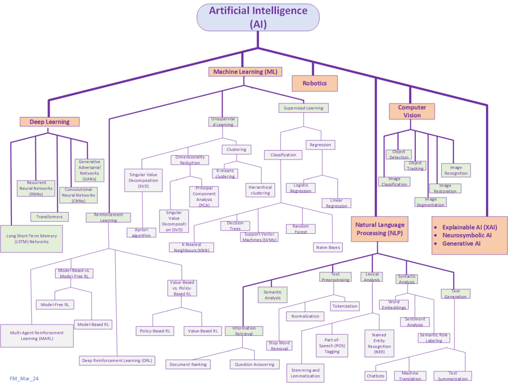

Kirish
================
**Sun'iy intellekt (AI)** - bu kompyuter tizimlarining odatda inson intellekti bilan bog'liq bo'lgan o'rganish, fikrlash, muammolarni hal qilish, idrok etish va qaror qabul qilish kabi vazifalarni bajarish qobiliyati. Amaliy jihatdan AI – bu berilganlardan (data) foydalanib modellash, bashorat va qaror qilishni optimallashtirishdir.

Sun'iy intellektning asosiy bo'limlari:

- Machine learning
- Computer vision
- Fuzzy logic
- Expert systems
- Robotics
- Neural networks/deep learning
- Natural language processing
