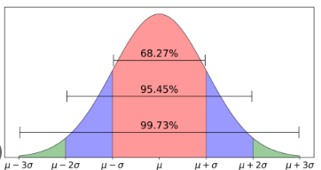

# Zichlik taqsimotlari

**Zichlik taqsimotlari (*probability density distributions*)** — ehtimollik nazariyasida va statistikada muhim tushuncha bo‘lib, tasodifiy miqdorlarning qanday qiymatlar atrofida ko‘proq to‘planishini ifodalaydi.

---

## Zichlik taqsimot turlari

### Diskret taqsimotlar  
Tasodifiy miqdor faqat *cheklangan yoki sanaladigan* qiymatlarni oladi.  
Misollar:

- Bernulli  
- Binomial  
- Geometrik  
- Poisson  
- Negativ binomial (Pascal)  

### Uzluksiz taqsimotlar  
Tasodifiy miqdor *istalgan haqiqiy qiymat*ni olishi mumkin.  
Misollar:

- Normal (Gauss)  
- Eksponensial  
- Birlashgan (Uniform)  
- Gamma  
- Beta  
- Kauchy  
- Log-normal  

### Maxsus/statistik taqsimotlar
Asosan statistika va testlarda qo‘llaniladi.  
Misollar:

- $\chi^2$ (chi-kvadrat)  
- Student t-taqsimoti  
- Fisher F-taqsimoti  

### Ko‘p o‘lchamli (multivariate) taqsimotlar
Bir nechta tasodifiy miqdorlarni birgalikda ifodalaydi.  
Misollar:

- Ko‘p o‘lchovli normal taqsimot  
- Multinomial taqsimot  
- Dirichlet taqsimoti  

---

### Zichlik funksiyalari(Density Functions)

- PMF (Probability Mass Function – ehtimollik massasi funksiyasi) - diskret taqsimotlar (sanoq bo‘yicha qiymatlar).
- PDF (Probability Density Function - ehtimollik zichlik funksiyasi) - uzluksiz taqsimotlar (cheksiz qiymatlar).
  
---

### Ehtimollik zichlik funksiyasi (PDF)

**Ehtimollik zichlik funksiyasi (PDF, *Probability Density Function*)** — bu uzluksiz tasodifiy miqdorning ehtimollik taqsimotini ifodalovchi matematik funksiya.

Agar $X$ – uzluksiz tasodifiy miqdor bo‘lsa, uning zichlik funksiyasi $f(x)$ quyidagi xossalarga ega:

1. Manfiy emaslik sharti:  

   $$
   f(x) \geq 0, \quad \forall x
   $$

2. Umumiy ehtimollik 1 ga teng:  

   $$
   \int_{-\infty}^{\infty} f(x)\, dx = 1
   $$

3. Oraliq ehtimolligi:
   Tasodifiy miqdor $X$ oraliq $(a, b)$ ga tushish ehtimoli:  

   $$
   P(a \leq X \leq b) = \int_{a}^{b} f(x)\, dx
   $$

---

## Gauss (Normal) taqsimot zichligi

**Gaus (normal) taqsimot zichligi** — bu $\mu$ o‘rtacha atrofida eng ko‘p to‘plangan va undan uzoqlashgan sari eksponensial tezlikda kamayadigan qo‘ng‘iroqsimon (bell-shaped) ehtimollik zichlik funksiyasi bo‘lib, statistikada eng ko‘p qo‘llaniladigan taqsimotdir.

Zichlik funksiyasi (PDF formulasi):

Agar $X \sim N(\mu, \sigma^2)$ normal taqsimotga ega bo‘lsa, uning zichlik funksiyasi quyidagicha:

$$
f(x) = \frac{1}{\sigma \sqrt{2\pi}} \exp\!\left( -\frac{(x-\mu)^2}{2\sigma^2} \right), \quad -\infty < x < \infty
$$

Bu yerda:

- $\mu$ — matematik kutilma (o‘rtacha qiymat)  

- $\sigma$ — standart og‘ish - ayni tarqoqlikni asl birlikda ifodalaydi. Amaliy tahlil, grafiklar, odatiy talqin uchun – standart og‘ish qulay.

$$
\mu = \frac{1}{n} \sum_{i=1}^n x_i
$$

- $\sigma^2$ — dispersiya - qiymatlarning o‘rtachadan kvadrat og‘ishi. tarqoqlikni kvadrat birlikda o‘lchaydi. Matematik nazariya, formulalar, ML algoritmlar – dispersiya majburiy, chunki u algebraik jihatdan ancha oddiy va qulay.

$$
\sigma = \sqrt{\frac{1}{n} \sum_{i=1}^n (x_i - \mu)^2}
$$

Asosiy xossalari:

1. Musbatlik

   $$
   f(x) \geq 0 \quad \text{barcha } x \text{ lar uchun}
   $$

1. Normallashganlik.
   Butun chiziq bo‘ylab integral 1 ga teng:  

   $$
   \int_{-\infty}^{\infty} f(x)\, dx = 1
   $$

1. Simmetriklik. Zichlik grafigi $\mu$ nuqtaga nisbatan simmetrik.

1. Maksimal qiymat. Zichlikning eng yuqori nuqtasi markazda $x = \mu$ bo‘lib, qiymati:  

   $$
   f(\mu) = \frac{1}{\sqrt{2\pi}\,\sigma}
   $$

1. Chegaralar:
   - Pastki chegara: $0$ (cheksiz uzoqda nolga intiladi).  
   - Yuqori chegara: $\dfrac{1}{\sqrt{2\pi}\,\sigma}$ (bu qiymat $\sigma$ ga bog‘liq).

    Standart normal taqsimot

    Agar $\mu = 0$, $\sigma = 1$ bo‘lsa:

    $$
    f(x) = \frac{1}{\sqrt{2\pi}} e^{-\frac{x^2}{2}}
    $$

    Bu taqsimot **standart normal taqsimot** yoki **Z-taqsimot** deb ataladi.

1. Normal (Gaus) taqsimotning klassik xossasi ma’lumotlarning uchrash extimolligi:

    - $[\mu - \sigma, \mu + \sigma] \;\; \approx 68.27\%$
    - $[\mu - 2\sigma, \mu + 2\sigma] \;\; \approx 95.45\%$
    - $[\mu - 3\sigma, \mu + 3\sigma] \;\; \approx 99.73\%$

    

---

## Dirichlet taqsimoti

Bu ko‘p o‘lchamli ehtimollik taqsimoti bo‘lib, odatda ko‘p nomli (categorical yoki multinomial) ehtimolliklarni modellashtirish uchun ishlatiladi. U Beta taqsimotining ko‘p o‘lchovli umumlashmasi hisoblanadi. Agar bizda bir nechta kategoriya bo‘lsa (masalan, 3 xil rang: qizil, ko‘k, yashil) va ularning ehtimollari qanday taqsimlanganini modellashtirmoqchi bo‘lsak, Dirichlet taqsimoti shu ehtimollarning tasodifiy taqsimlanishini beradi.

Agar $K$ o‘lchamli ehtimollik vektori

$$
\mathbf{x} = (x_1, x_2, \dots, x_K)
$$

bo‘lib,

$$
x_i \geq 0, \quad \sum_{i=1}^K x_i = 1
$$

bo‘lsa, $\mathbf{x}$ **Dirichlet taqsimoti**ga ega deyiladi:

$$
f(x_1, \dots, x_K; \alpha_1, \dots, \alpha_K) =
\frac{1}{B(\alpha)} \prod_{i=1}^K x_i^{\alpha_i - 1}
$$

Bu yerda:  

- $\alpha = (\alpha_1, \alpha_2, \dots, \alpha_K)$ — **parametrlar vektori**, $\alpha_i > 0$  
- $B(\alpha)$ — **Beta funksiyasining umumlashgan ko‘rinishi**  

$$
B(\alpha) = \frac{\prod_{i=1}^K \Gamma(\alpha_i)}{\Gamma\!\left(\sum_{i=1}^K \alpha_j\right)}
$$

### Asosiy xossalari

1. Parametrlar ta’siri

   - $\alpha_i$ katta bo‘lsa, $x_i$ kattaroq qiymatlarni olishga moyil bo‘ladi.  
   - $\alpha_i < 1$ bo‘lsa, taqsimot burchaklarga yaqinlashadi.  
   - $\alpha_i = 1$ bo‘lsa, taqsimot bir tekis (uniform).  

1. Matematik kutilma

$$
\mathbb{E}[X_i] = \frac{\alpha_i}{\sum_{j=1}^K \alpha_j}
$$

1. Beta taqsimot bilan aloqasi
  
   - $K=2$ holatda Dirichlet taqsimoti oddiy **Beta taqsimoti**ga teng.  

### Misol

data = [1, 1, 1, 1, 1, 1, 1, 1, 1, 1, 2, 2, 2, 3, 3]
Dirichlet: data = {1×10, 2×3, 3×2},  α = [10, 3, 2]

Bu yerda uchta kategoriya bor (1, 2, 3). Berilgan ro‘yxatdagi sanash natijasida:  $n_1 = 10$, $n_2 = 3$, $n_3 = 2$ (jami $N=15$).
Dirichlet parametrlari: $\alpha = (\alpha_1, \alpha_2, \alpha_3) = (10, 3, 2)$,  
va $\alpha_0 = \sum_i \alpha_i = 15$.

## $\alpha$ ni taqsimotning o‘zi sifatida talqin qilish

Agar $\mathbf{p} = (p_1, p_2, p_3) \sim \mathrm{Dir}(\alpha)$ bo‘lsa:

- **Kutilma (mean)**  
  
  $$
  \mathbb{E}[p_i] = \frac{\alpha_i}{\alpha_0}
  = \left(\tfrac{10}{15}, \tfrac{3}{15}, \tfrac{2}{15}\right)
  = (0.6667, 0.2000, 0.1333).
  $$

- **MAP** (agar $\alpha_i > 1$)  
  
  $$
  p_i^{\text{MAP}} = \frac{\alpha_i-1}{\alpha_0-K}
  = \left(\tfrac{9}{12}, \tfrac{2}{12}, \tfrac{1}{12}\right)
  = (0.75, 0.1667, 0.0833).
  $$

- **Dispersiya**  
  
  $$
  
  \mathrm{Var}(p_i) = \frac{\alpha_i(\alpha_0-\alpha_i)}{\alpha_0^2(\alpha_0+1)}
  \Rightarrow
  \begin{cases}
  \mathrm{Var}(p_1)\approx 0.01389 \\
  \mathrm{Var}(p_2)\approx 0.01000 \\
  \mathrm{Var}(p_3)\approx 0.00722
  \end{cases}
  $$
  (Kovariatsiyalar manfiy:
  $\mathrm{Cov}(p_i,p_j)=-\frac{\alpha_i\alpha_j}{\alpha_0^2(\alpha_0+1)}$.)

Intuitiv ma’no: $\alpha$ — “psevdo-hisoblar” (pseudo-counts). $\alpha_0=15$ katta bo‘lgani sari $\mathbf{p}$ o‘rtacha atrofida (0.667, 0.2, 0.133) kuchliroq jamlanadi.

Grafik ko‘rinishi

Dirichlet(10, 3, 2) dan olingan 3000 ta namunalar 2-simpleksda (uchburchak) quyidagicha tarqaladi:

- ⭐ belgisi — kutilma $(0.6667, 0.2000, 0.1333)$  
- ✖️ belgisi — MAP $(0.75, 0.1667, 0.0833)$  
- Nuqtalar — tasodifiy namunalar
